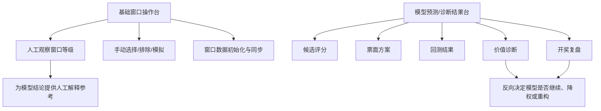

# 前端模块规划

## 规划目标

当前前端已经能够支撑“基础窗口操作台”：查看开奖、初始化/同步基础窗口、展示窗口等级矩阵、手动选择号码、排除号码、模拟位移和多窗口联动。

后端已经逐步增加了坐标、结构族、多窗口评分、回测、诊断、真实预测等能力。如果继续把所有能力都堆到首页，会让页面越来越重，也会让“手动观察窗口”和“模型输出验证”混在一起，难以定位问题。因此前端需要拆成两条主线：

1. 基础窗口操作台：继续服务人工观察、窗口联动、模拟选择。
2. 实时预测台：承接后端评分、候选池和最终票面输出。
3. 快照复盘台：承接开奖后基于快照的复盘、收益和诊断包保存。
4. 诊断研究台：承接回测、漏号、贝叶斯冷热、保底扩展等研究诊断。

## 模块边界

### 基础窗口操作台

基础窗口操作台保留现有首页能力，核心目标是“看清窗口状态，并允许人工模拟”。

建议路由：

- `/window-console`

建议承载内容：

- 最新开奖信息和期号切换。
- 红球、蓝球、红尾、蓝尾基础窗口矩阵。
- 窗口统计期号与窗口数据期号检查。
- 窗口数据初始化、同步、统计更新。
- 号码选择、号码排除、模拟模式、猜测模式。
- 行折叠、列折叠、多窗口同类联动。

适合保留的现有组件：

- `LatestDrawInfo.vue`
- `WindowStatusModal.vue`
- `WindowLevelPanel.vue`
- `WindowLevelTable.vue`
- `BallBall.vue`

后续优化重点：

- 将 `WindowLevelPanel.vue` 中的折叠逻辑、选择联动逻辑、统计汇总逻辑拆到 `composables/window/`。
- 将 `redBallStateMap` 改名为更通用的 `ballStateMap`，因为它实际承载红球、蓝球、红尾、蓝尾。
- 将窗口数据状态和窗口统计状态抽成专门的状态服务，避免弹窗、面板、表格之间重复判断期号。

### 实时预测台、快照复盘台、诊断研究台

模型相关页面是新增主线，核心目标是“开奖前输出可保存的预测证据，开奖后按快照复盘，并通过诊断研究判断模型是否真的进步”。

建议路由：

- `/prediction-console`：实时预测台。
- `/snapshot-review`：快照复盘台。
- `/diagnostic-lab`：诊断研究台。
- `/model-dashboard`：旧入口兼容，重定向到 `/prediction-console`。

实时预测台承载内容：

- 红球多窗口候选评分。
- 蓝球多窗口候选评分。
- 红球组合形态评分。
- 9+1 复式方案。
- 10注 6+1 单式方案。
- 保存开奖前预测快照。

快照复盘台承载内容：

- 最近预测快照列表。
- 历史快照读取。
- 开奖后复盘、奖级、奖金和净收益。
- 保存诊断包。

诊断研究台承载内容：

- 红球漏号诊断。
- 多期复盘趋势。
- 多期漏号统计。
- 贝叶斯冷热诊断。
- 保底扩展回测。
- 配额保底回测。
- 配额网格回测。

建议新增组件：

- `PredictionSummaryPanel.vue`：展示下一期核心预测结果。
- `CandidateScoreTable.vue`：展示红球/蓝球候选评分明细。
- `TicketPlanPanel.vue`：展示 9+1、胆拖、10注6+1 等票面方案。
- `BacktestResultTable.vue`：展示回测结果、命中数量、成本收益。
- `DiagnosisMetricCard.vue`：展示随机基线、模型命中率、lift 等诊断指标。
- `PeriodReviewPanel.vue`：展示某一期预测和实际开奖的复盘。

建议新增状态模块：

- `stores/modelPrediction.ts`：预测结果、候选池、票面方案。
- `stores/modelBacktest.ts`：回测结果和参数网格。
- `stores/modelDiagnosis.ts`：模型价值诊断、蓝球长区间诊断。

建议新增接口模块：

- `src/api/modules/modelPrediction.ts`
- `src/api/modules/modelBacktest.ts`
- `src/api/modules/modelDiagnosis.ts`

## 页面关系

## 开发顺序建议

### 第一阶段：路由和页面拆分

目标是先把“基础窗口操作台”和“模型预测/诊断结果台”的入口拆开，但不急着大规模改动已有组件。

已完成动作：

- 新增 `WindowConsole.vue`，承载原有基础窗口操作台。
- 新增 `ModelDashboard.vue`，承载模型预测/诊断结果台第一版。
- 在 `App.vue` 增加顶部导航。
- `/` 默认重定向到 `/window-console`，避免破坏当前使用习惯。

### 第二阶段：接入预测接口

目标是让前端能展示后端已经存在的真实预测结果。

已完成动作：

- 新增 `src/api/modules/modelPrediction.ts`。
- 接入 `/ssq/window/axis/score/final/multi-window/predict`。
- 接入 `/ssq/window/axis/score/final/single-ticket-plan/predict`。
- 展示预测期号、推荐票面、红球组合榜、蓝球候选榜、红蓝合并票面榜。
- 展示10注6+1单式方案、反推9红参考池、反推胆候选、蓝球候选和形态信息。

后续待补：

- 如果后端单独输出“排尾前后两条预测线”，前端再增加并列展示。

### 第三阶段：接入回测和诊断

目标是让系统不只“给号”，还可以证明某个策略是否值得继续。

建议动作：

- 新增回测接口模块。
- 新增模型诊断接口模块。
- 展示随机基线、模型命中率、平均红球命中、蓝球 TopN 命中。
- 支持按窗口、候选数量、阈值、蓝球策略查看结果。

### 第四阶段：预测记录和开奖复盘

目标是形成长期验证链，避免只凭最近一两期感觉判断系统价值。

已完成动作：

- 后端新增 `tb_ssq_prediction_snapshot` 表。
- 后端新增 `/ssq/window/axis/prediction/snapshot/save` 保存接口。
- 后端新增 `/ssq/window/axis/prediction/snapshot/latest` 和 `/list` 查询接口。
- 前端模型预测/诊断结果台新增“保存快照”按钮。
- 快照保存当前页面已经展示的预测结果，不重新计算，确保开奖前证据链稳定。
- 前端模型预测/诊断结果台新增“读取快照”和“历史快照模式”。
- 点击某条快照后，页面使用快照JSON回填预测结果，不重新调用预测接口。
- 历史快照模式下显示快照ID、保存时间，并提供“返回实时预测”按钮。
- 前端模型预测/诊断结果台新增“开奖信息”区域，显示最新开奖号、当前预测期号和当前快照复盘条件。
- 开奖信息区域提供“同步开奖”按钮，用于刷新前端本地开奖缓存，避免复盘条件判断停留在旧数据。
- 前端模型预测/诊断结果台新增“复盘快照”按钮。
- 最近快照列表每行新增“复盘/查看复盘”按钮，不再要求用户先进入某条快照后才能复盘。
- 复盘结果展示实际开奖号、红球候选池最高命中、蓝球候选是否命中、10注6+1奖金和净收益。
- 最近快照列表新增复盘状态和可复盘状态，区分“未复盘/已复盘”和“待开奖/已开奖”。
- 前端模型预测/诊断结果台新增“漏号诊断”按钮。
- 漏号诊断展示主红球候选池覆盖、10注6+1票面池覆盖、真实漏号、实际形态和每个真实红球在红10/20/33中的窗口状态。
- 前端模型预测/诊断结果台新增“漏号分布统计”按钮。
- 漏号分布统计展示已复盘快照的主候选池覆盖率、10注票面池覆盖率、完全漏号率、10注补回数量，以及完全漏号在号码、三区、红10/20/33 level、willDown上的分布。

后续待补：

- 统计连续多期表现。
- 展示模型是否改善、退化或只是随机波动。
- 快照样本达到5期以上后，将漏号分布统计用于判断是否需要候选池保底扩展。

### 第五阶段：模型页面职责拆分

目标是把原本臃肿的模型预测/诊断结果台拆成更清晰的三个页面入口。

已完成动作：

- 新增 `/prediction-console` 实时预测台。
- 新增 `/snapshot-review` 快照复盘台。
- 新增 `/diagnostic-lab` 诊断研究台。
- `/model-dashboard` 兼容重定向到 `/prediction-console`。
- 顶部导航增加实时预测台、快照复盘台、诊断研究台。
- 开奖信息区保留同步开奖/窗口和同步坐标结构链，顶部重复同步区域已移除。
- 诊断研究台按钮改为开关式，打开后高亮，再次点击关闭。
- 诊断研究台新增“配额网格回测”，用于比较不同保底来源配额组合，暂不影响正式预测票面。

后续待补：

- 将当前复用的 `ModelDashboard.vue` 拆成预测、复盘、诊断三个页面组件。
- 将票面展示、快照列表、诊断区块抽成独立组件。
- 将预测、快照、诊断状态抽为 store 或 composable。

## 当前同步弹窗处理原则

窗口状态弹窗中的批量同步需要遵循以下原则：

- 已是最新时，提示“无需同步”，不再强行调用所有窗口同步。
- 后端返回空增量或 `null` 时，前端应视为正常的“无新增数据”。
- 单个窗口失败不应该遮住其他窗口的同步结果。
- 本地未初始化的窗口应被跳过并提示数量，而不是让整个批量同步直接中断。
